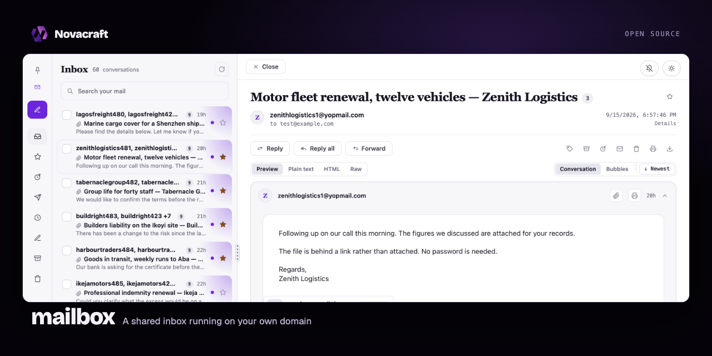

# Mailbox

A shared webmail app you host yourself. One codebase, one deployment per
mailbox. Inbox and threads, a composer with signatures and templates,
attachments on S3-compatible storage, sharing links, full-text search, web
push, PWA install, accounts with roles, and password reset.

Everything specific to you — name, domain, colours, signature copy, artwork —
lives in configuration. Nothing in this repository names or pictures any one
business, and nothing added to it should.

## Running your own

1. Copy `.env.example` and fill it in.
2. Put three images on the volume at `BRAND_ASSET_DIR`. See
   [public/brand/README.md](public/brand/README.md) for the sizes.
3. Point `DATABASE_URL` at a SQLite file on a mounted volume.
4. Deploy it anywhere that runs Next.js. The schema is created on first boot
   and migrates itself forward, so there is no migration step to run.

It is a plain Next.js app, so Vercel, Coolify, Docker on a VPS, Fly, Render and
Railway all work. Nothing in the code assumes a particular host.

## Trying it locally

Outside production the app seeds one account for you — `test@<MAIL_ADDRESS_DOMAIN>`,
an admin whose password is the address itself — so a fresh checkout can be
signed into without configuring seats. It is never seeded when
`NODE_ENV=production`.

`node --experimental-strip-types scripts/seed-dev.mjs` then fills that mailbox
with enough traffic to exercise the list, search, paging and attachments.
Create the schema first by starting the app once, or by calling
`ensureMailSchema()`.

The attachments are real files, not records: a PDF, a photo, a short video, a
spreadsheet and a Word document, generated on the spot and uploaded once.
Pictures and video need `ffmpeg` and the document needs `zip`; whatever is
missing is skipped. With no bucket configured the seed still runs and writes
the records alone.

## Configuration

`lib/brand.ts` is the server-side source of identity — name, domain, signature
copy, colours, seats, aliases. `lib/brand.client.ts` is the browser half, read
from `NEXT_PUBLIC_*` and inlined at build time, so changing anything the
browser shows means a rebuild.

Seats are JSON in `MAIL_SEATS` and seed on first boot only; after that you
manage accounts in the app. `MAIL_ADDRESS_ALIASES` redirects delivery for a
seat whose mail someone else now reads.

## Storage

`DATABASE_URL` is any SQLite or libSQL database. A `file:` URL is local SQLite
on a mounted volume, which is what a single box wants. A `libsql://` URL points
at a hosted one — Turso, or your own `sqld` — and takes `DATABASE_AUTH_TOKEN`.

If you would rather not run a database at all, leave `DATABASE_URL` unset and
fill in the Cloudflare D1 variables instead; the app falls back to D1 over its
REST API. Either way the queries are the same SQLite, so you can move between
them without a coordinated redeploy.

Attachments go to any S3-compatible bucket through the `S3_*` variables: AWS
S3, Cloudflare R2, Backblaze B2, MinIO, Wasabi. The older `R2_*` names still
work if you already set them.

**The bucket needs a CORS rule.** The browser uploads straight to it with a
signed URL, so the bucket has to allow `PUT`, `GET` and `HEAD` from the address
the app is served on. Without one every attachment fails, and the browser
reports it the same way it reports being offline — so it reads as a network
problem rather than a missing rule. On R2:

```json
[{ "AllowedOrigins": ["https://mail.example.com"],
   "AllowedMethods": ["PUT", "GET", "HEAD"],
   "AllowedHeaders": ["*"],
   "ExposeHeaders": ["ETag", "Content-Length", "Content-Type", "Content-Disposition", "Content-Range", "Accept-Ranges", "Last-Modified"],
   "MaxAgeSeconds": 3600 }]
```

List only your own origin. A wildcard lets any page that obtains a signed URL
upload with it.

## Sending

`MAIL_PROVIDER` picks `ses`, `resend` or `brevo` behind one seam, so switching
providers is an environment change rather than a code change. SES is signed
in-process, with no SDK. Adding a fourth provider means one send function and one case in
`lib/mail-provider.ts`.

## Tests

```
npx tsx --test lib/*.test.ts
```

## Licence

MIT. See [LICENSE](LICENSE).
